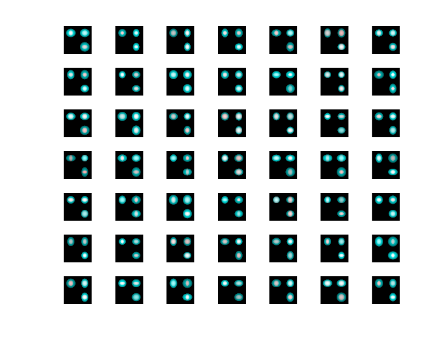
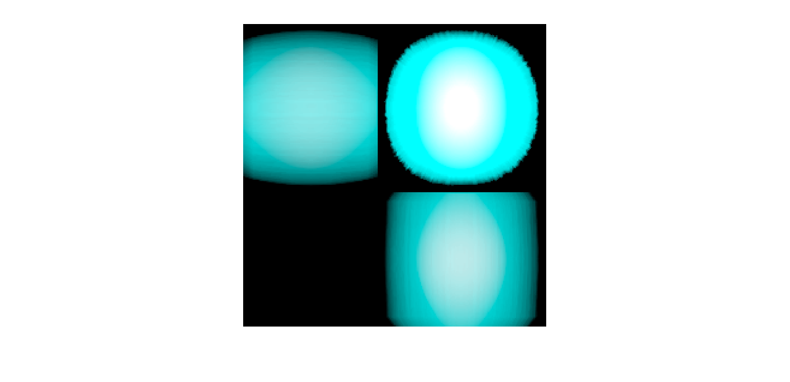

# Workshop_2016
## Repository for models, descriptions, and code to be used for the 2016 Workshop.

Ideally we would like the 2016 workshop to demonstrate a pipelining of our tools using a single multi-scale model. However, since many of our tools operate on different scales, it may be necessary to simplify certain aspects of the model or otherwise address the multi-scale issue so it will be manageable within the time and computational constraints of the workshop.

This repository has been created as a place to work out an appropriate model for the workshop consistent with our February 25th decision.

At this point, the candidate tools for such a joint model are:

* **[CellBlender](cellblender/README.md)**
* **MCell**
* **BioNetGen**
* **CellOrganizer**

Please feel free to add/delete tools that might participate in this portion of the workshop.

As of March 31st, we have a preliminary model from CellOrganizer with an organelle added by CellBlender:


## CellOrganizer

The CellOrganizer project provides tools for

* learning generative models of cell organization directly from images
* storing and retrieving those models
* synthesizing cell images (or other representations) from one or more models

In this section of the tutorial we are going to use CellOrganizer to

* train a framework (cell and nuclear membrane) model from simple 3D shapes
* synthesize an instance from the trained model and export as a Wavefront .obj file

### Generating simple geometries
First we use a CellOrganizer helper function to generate a collection of toy images.
These simply geometries can then be used to train a generative model.

The first step is to seed the random number generator to obtain reproducibly-random instances.
```
%%%%%%%%%%%%%%%%%%%%%%%%%%%%%%%%%%%%%%%%%%%%%%%%%%%%%%%%%%%%%%%%%%%%%%%%%%%
% SEED EXAMPLE
seed = 3;
Stream.create( 'mt19937ar', 'seed', seed );
RandStream.setDefaultStream( state );
%%%%%%%%%%%%%%%%%%%%%%%%%%%%%%%%%%%%%%%%%%%%%%%%%%%%%%%%%%%%%%%%%%%%%%%%%%%
```

The helper method `generate_ellipsoid` returns a 3D array with centered ellipsoid.

```
%%%%%%%%%%%%%%%%%%%%%%%%%%%%%%%%%%%%%%%%%%%%%%%%%%%%%%%%%%%%%%%%%%%%%%%%%%%
% GENERATE SIMPLE GEOMETRIES
if ~exist( './synthetic_images' )
    mkdir( './synthetic_images' );
end

for i=1:1:25
    options.image_size = 256;

    a = randi([1/4*options.image_size 1/2*options.image_size]);
    b = randi([1/4*options.image_size 1/2*options.image_size]);
    c = randi([1/4*options.image_size 1/2*options.image_size]);
    filename = ['./synthetic_images/synthetic' num2str(sprintf('%04d',i)) '_0.tif'];
    if ~exist( filename )
        disp(['Making image ' filename]);
        img = generate_ellipsoid(a,b,c,options);
        img2tif( img, filename, 'lzw' );
    end

    a = randi([1/2*options.image_size 3/4*options.image_size]);
    b = randi([1/2*options.image_size 3/4*options.image_size]);
    c = randi([1/2*options.image_size 3/4*options.image_size]);
    filename = ['./synthetic_images/synthetic' num2str(sprintf('%04d',i)) '_1.tif'];
    if ~exist( filename )
        disp(['Making image ' filename]);
        img = generate_ellipsoid(a,b,c,options);
        img2tif( img, filename, 'lzw' );
    end
end
%%%%%%%%%%%%%%%%%%%%%%%%%%%%%%%%%%%%%%%%%%%%%%%%%%%%%%%%%%%%%%%%%%%%%%%%%%%
```

The resulting image collection will look something like this (this should be edited to remove some whitespace. Also, the subimages should be larger; it's hard to see the differences between each subimage.)



For convenience we will provide you with the image collection.

### Training a model with simple geometries

Now, we use `img2slml`, the main model training function. `img2slml` takes five inputs:

* a flag for the dimensionality of the data (2D/3D)
* nuclear images
* cell images
* (optional) protein images
* options used to change default model settings.

We can use the latter method to train a nuclear and cell membrane model from those geometries. The next block shows how to train the model
(what is the latter method? what kind of model are we training?)

```
%%%%%%%%%%%%%%%%%%%%%%%%%%%%%%%%%%%%%%%%%%%%%%%%%%%%%%%%%%%%%%%%%%%%%%%%%%%
% TRAIN MODEL WITH SIMPLE GEOMETRIES
clear options

% location of TIF files and resolution
dna = './synthetic_images/*_0.tif';
cell = './synthetic_images/*_1.tif';
options.model.resolution = [0.049, 0.049, 0.2000];

%training flag is set to framework because want to train a model for
%nuclear and cell shape
options.train.flag = 'framework';

%train model at full resolution
options.downsampling = [1 1 1];

%combination of supported model class and type
options.nucleus.name = 'ellipsoids';
options.nucleus.class = 'nuclear_membrane';
options.nucleus.type = 'cylindrical_surface';

%combination of supported model class and type
options.cell.name = 'ellipsoids';
options.cell.class = 'cell_membrane';
options.cell.type = 'ratio';

%output filename
options.model.filename = 'model.mat';

%helper options
options.verbose = true;
options.debug = true;

%CellOrganizer call
img2slml( '3D', dna, cell, [], options );
%%%%%%%%%%%%%%%%%%%%%%%%%%%%%%%%%%%%%%%%%%%%%%%%%%%%%%%%%%%%%%%%%%%%%%%%%%%
```

`img2slml` automatically saves the trained model's parameter structure in a reasonable default location. A save-path can be passed in the options struct.

```
>> ls model.mat
model.mat
```

model.mat contains nuclear and cell membrane models
```
>> load model
>> model.nuclearShapeModel

ans =

          name: 'ellipsoids'
       surface: [1x1 struct]
        height: [1x1 struct]
          type: 'cylindrical_surface'
    resolution: [0.0490 0.0490 0.2000]
            id: ''

>> model.cellShapeModel

ans =

            name: 'ellipsoids'
       meanShape: [1x1 struct]
       modeShape: [1x1 struct]
          eigens: [1x1 struct]
    cellnucratio: [1x1 struct]
       nucbottom: [1x1 struct]
            type: 'ratio'
      resolution: [0.0490 0.0490 0.2000]
              id: ''
```

The trained model can then be used to generate synthetic instances.

### Image synthesis using a model trained on simple geometries

`slml2img` is the main function for image synthesis. This function takes two inputs
* a cell array containing paths to the models from which we want to synthesize
* options used to change default synthesis settings

We can use the latter method to sample from the distributions and a synthesize nuclear and cell membrane instance. Next, we synthesize an image:
(not sure what the latter method is. what are 'the distributions'?)

```
%%%%%%%%%%%%%%%%%%%%%%%%%%%%%%%%%%%%%%%%%%%%%%%%%%%%%%%%%%%%%%%%%%%%%%%%%%%
% SYNTHESIZE IMAGE FROM MODEL
model_file_path = './model.mat';

clear options
options.targetDirectory = pwd;

%output folder name
options.prefix = 'examples';

%number of images to synthesize
options.numberOfSynthesizedImages = 1;

%save images as TIF files
options.output.tifimages = true;

%compression for TIF output
options.compression = 'lzw';

%do not apply point-spread-function
options.microscope = 'none';

%render Gaussian objects as discs
options.sampling.method = 'disc';

%overlap frequency model and generate a single object
options.numberOfGaussianObjects = 1;

%generate framework
options.synthesis = 'framework';

%generate Wavefront obj. files
options.output.blenderfile = true;
options.output.blender.downsample = [1 1 1];

%helper options
options.verbose = true;

%CellOrganizer call
slml2img( {model_file_path}, options );
%%%%%%%%%%%%%%%%%%%%%%%%%%%%%%%%%%%%%%%%%%%%%%%%%%%%%%%%%%%%%%%%%%%%%%%%%%%
```

Note the flags for generating .obj files:

```
%generate Wavefront obj. files
options.output.blenderfile = true;
options.output.blender.downsample = [1 1 1];
```

which tell CellOrganizer to save the synthetic image as indexed polygon meshes that can be imported into Blender for use with CellBlender.

The files will be saved in the default `examples` folder

```
>> ls examples
cell1

>> ls examples/cell1
cell.mtl	cell.tif	nucleus.obj
cell.obj	nucleus.mtl	nucleus.tif
```

The synthetic image will look like:


